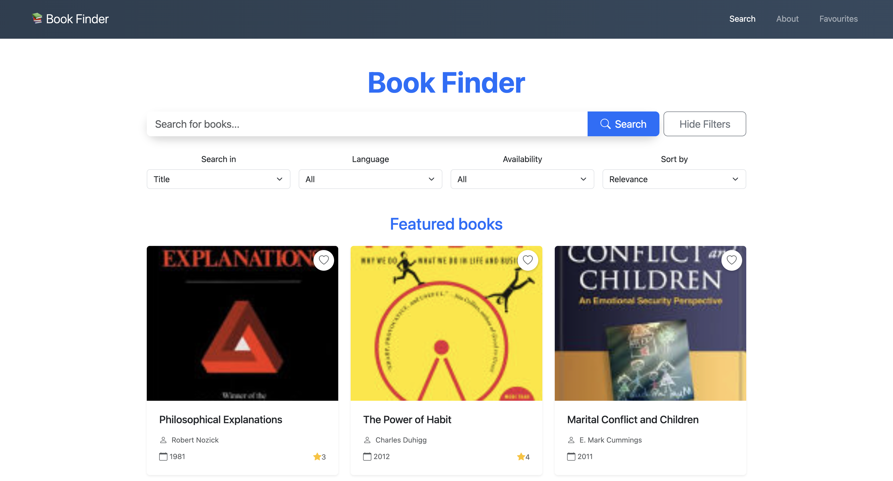

# Book Finder

Book Finder is a web application built with **Angular**, **Node.js**, **Express**, **MongoDB**, and **Bootstrap**.  
It helps users search for books via the **Google Books API** and save favourites to a MongoDB database.



---

## Features

- **Search Books:** Look for books by title, author, genre, publisher, or ISBN.
- **Book Details:** View more information on each book, including description, published date, categories, ISBN, availability, and ratings.
- **Favourites:** Save favourite books, view them later, or remove them.
- **Pagination:** Easily navigate through search results.
- **Responsive Design:** Works well on both mobile and desktop devices.

---

## Tech Stack

- **Frontend:** Angular, Bootstrap, TypeScript
- **Backend:** Node.js, Express
- **Database:** MongoDB
- **External API:** Google Books API

---

## Architecture

- **Frontend:** Angular handles the UI, routing, and API calls.
- **Backend:** Express server provides endpoints to manage favourite books.
- **Database:** MongoDB stores user favourites and additional info.

---

## How to Run

1. Clone the repository:

```bash
git clone https://github.com/samuel-kocych/book-finder.git
```

2. Install frontend dependencies and start Angular:

```bash
cd book-finder
npm install
ng serve
```

3. Install backend dependencies and start Express server:

```bash
cd book-api-server
npm install
npm run dev
```

4. Open the app in your browser: http://localhost:4200


## Notes
- **Project was also hosted on AWS S3 and EC2 for demo purposes.
- **User favourite books are stored in MongoDB via the Express server.
